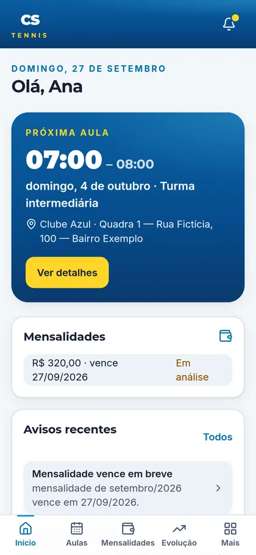
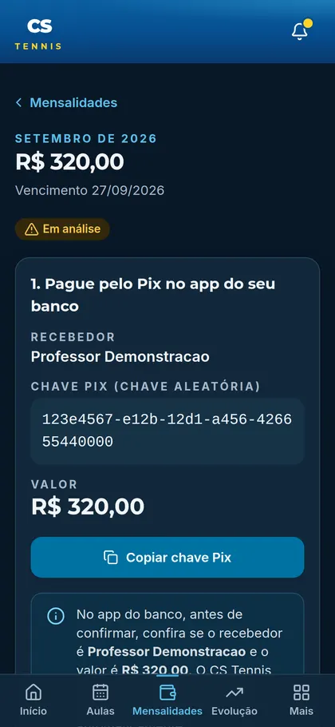
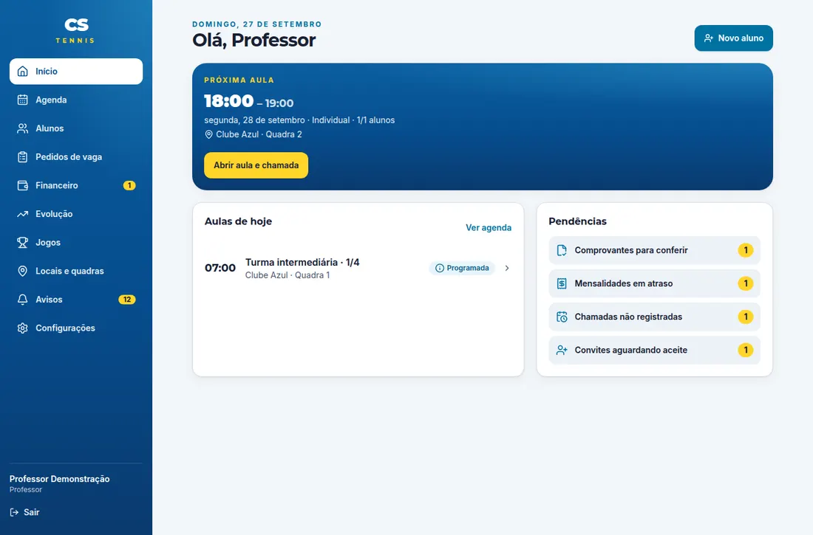

# CS Tennis

Sistema web para um professor de tênis gerenciar alunos adultos, responsáveis por alunos
crianças, horários fixos semanais, pedidos de vaga, presença, mensalidades com Pix manual,
comprovantes, evolução técnica, jogos e avisos. Funciona no navegador (celular e computador),
sem lojas de aplicativos.

> **Situação atual: pronto para homologação local, NÃO pronto para produção.**
> O código, o banco (com RLS) e os testes estão completos e passam localmente, mas o uso com
> clientes reais depende de infraestrutura que ainda não foi configurada: projeto Supabase de
> produção, hospedagem, SMTP próprio para os e-mails de acesso, serviço antimalware hospedado,
> plano de backup e revisão jurídica do aviso de privacidade. Veja
> [docs/LIMITACOES.md](docs/LIMITACOES.md) e [docs/CHECKLIST_HOMOLOGACAO.md](docs/CHECKLIST_HOMOLOGACAO.md).

| Aluno (celular) | Pix e comprovante | Professor (desktop) |
| --- | --- | --- |
|  |  |  |

Capturas geradas pelos testes E2E com dados **fictícios** (`npm run screenshots`). Todas estão em
[docs/screenshots](docs/screenshots).

## O que está implementado

- **Professor** (conta criada só por provisionamento administrativo, com verificação em duas etapas obrigatória):
  cadastro de alunos adultos e crianças (com responsável), convites de acesso de uso único, locais e quadras,
  horários fixos (individual, dupla, grupo, capacidade), matrícula direta, aprovação/recusa de pedidos de vaga,
  agenda semanal/mensal, remarcação e cancelamento de aula, indisponibilidade, chamada (presença),
  mensalidades individualizadas, cobranças avulsas, conferência de comprovantes, baixa manual, estorno,
  regras de inadimplência (aviso / bloquear pedidos / restringir módulos, carência, liberação temporária auditada),
  avaliações técnicas (1–5 por fundamento, "não avaliado" separado), metas, comentários em jogos,
  avisos, configurações de Pix (com confirmação de identidade), privacidade e saúde do sistema.
- **Aluno adulto**: próxima aula em destaque, aulas, horários com vaga e pedidos, frequência,
  mensalidades com dados do Pix (copiar chave, QR Code/BR Code quando configurado) e envio de comprovante,
  evolução, jogos (placar por set, tie-break, match tie-break, W.O., desistência), avisos, perfil e tema.
- **Responsável**: as mesmas telas para cada criança vinculada, com troca de aluno; sem acesso a outros alunos.
- **Avisos no app** gerados por uma fila transacional (outbox) sem duplicidade, com estrutura pronta para
  canais futuros como WhatsApp (não integrado).
- **Tema** claro, escuro ou do sistema por usuário; pt-BR, BRL e fuso America/Sao_Paulo.

Detalhes: [docs/ARQUITETURA.md](docs/ARQUITETURA.md) · [docs/MODELO_DE_DADOS.md](docs/MODELO_DE_DADOS.md) ·
[docs/MATRIZ_DE_PERMISSOES.md](docs/MATRIZ_DE_PERMISSOES.md) · [docs/DECISOES.md](docs/DECISOES.md).

## Stack

Next.js 16 (App Router, React 19, TypeScript estrito, Tailwind CSS 4) · Supabase (Postgres 17 com RLS,
Auth com TOTP, Storage privado, pg_cron) · Zod · ClamAV (clamd) para antimalware · Vitest e Playwright.

## Rodando localmente

Pré-requisitos: Node.js 22+, Docker (com ~8 GB livres) e acesso à internet para baixar as imagens.

```bash
npm ci
npm run db:start            # Supabase local (Postgres, Auth, Storage, Mailpit) — aplica as migrations
npm run env:local           # gera .env.local a partir do Supabase local (segredos aleatórios)

# Antimalware local (opcional, recomendado). Sem ele os comprovantes ficam em quarentena.
docker run -d --name cstennis-clamav -p 127.0.0.1:3310:3310 clamav/clamav:stable

npm run seed:demo           # dados FICTÍCIOS + .demo-credentials.json (não versionado)
npm run dev                 # http://localhost:3000
```

E-mails locais (código do convite, redefinição de senha) chegam no Mailpit: http://127.0.0.1:54324.

### Contas de demonstração (somente locais, fictícias)

Criadas por `npm run seed:demo`; senha comum `Demo-CSTennis-2026` (também em `.demo-credentials.json`).

| Perfil | E-mail |
| --- | --- |
| Professor (pede código TOTP) | `professor@demo.cstennis.test` — código atual: `npm run totp:demo` |
| Aluna adulta | `ana@demo.cstennis.test` |
| Aluno adulto | `bruno@demo.cstennis.test` |
| Aluna com mensalidade vencida | `carla@demo.cstennis.test` |
| Responsável por duas crianças | `marina@demo.cstennis.test` |

O seed também cria um aluno com convite pendente (Eduardo) e dados de aulas, presença, avaliações, jogos,
cobranças e um comprovante em análise. Para recomeçar do zero: `npm run db:reset && npm run seed:demo`.

## Provisionamento seguro do professor (sem cadastro público)

Não existe "Criar conta". A conta do professor é criada por quem administra a infraestrutura, em máquina confiável:

```bash
npx tsx --env-file=.env.production.local scripts/bootstrap-coach.ts \
  --email professor@dominio.com.br --name "Nome do Professor" --org "CS Tennis"
```

O script cria a conta sem senha, a organização e o vínculo de professor, e imprime **uma vez** um link de uso
único (15 min) para o professor definir a senha. No primeiro acesso o sistema exige configurar o autenticador
(TOTP). O arquivo `.env.production.local` contém a chave de serviço: use-o só nessa máquina e apague-o depois.
Detalhes em [docs/PUBLICACAO.md](docs/PUBLICACAO.md).

## Comandos

| Comando | O que faz |
| --- | --- |
| `npm run dev` / `build` / `start` | Desenvolvimento, build de produção e servidor de produção |
| `npm run lint` · `npm run typecheck` | ESLint · tipos de rotas + `tsc --noEmit` |
| `npm run test:unit` | Testes unitários (dinheiro, datas, Pix/BR Code, placar, arquivos, antimalware…) |
| `npm run test:integration` | Testes no banco real local (RLS, RPCs, concorrência, jobs) — exige `db:start` |
| `npm run test:e2e` | Playwright em 360px e desktop — exige `db:start`, `seed:demo` e `build` |
| `npm run screenshots` | Regera as capturas de tela de `docs/screenshots` |
| `npm run db:reset` · `npm run db:types` | Recria o banco local · regenera os tipos TypeScript do banco |
| `npm run seed:demo` · `npm run totp:demo` | Dados fictícios · código TOTP do professor de demonstração |
| `npm run audit:deps` | Auditoria de dependências de produção |

Resultados da última execução e cobertura dos critérios de aceite: [docs/TESTES.md](docs/TESTES.md).

## Configuração

Variáveis em [.env.example](.env.example) (todas lidas só no servidor; nenhuma `NEXT_PUBLIC_`).
Serviços externos, custos e passos manuais: [docs/SERVICOS_E_CUSTOS.md](docs/SERVICOS_E_CUSTOS.md) e
[docs/PUBLICACAO.md](docs/PUBLICACAO.md).

## Logotipo

Não havia arquivo do logotipo oficial, só uma captura de tela; por isso o app usa a marca textual "CS Tennis"
provisória (`src/components/brand/brand.tsx`). Para trocar, coloque o arquivo em `public/brand/` e defina
`BRAND_LOGO_SRC` (ex.: `/brand/logo.svg`).

## Documentação

- **[Próximos passos para colocar no ar](docs/PROXIMOS_PASSOS.md)** (situação atual da implantação e o que falta)
- [Arquitetura](docs/ARQUITETURA.md) e [decisões técnicas e premissas](docs/DECISOES.md)
- [Modelo de dados](docs/MODELO_DE_DADOS.md) e [matriz de permissões](docs/MATRIZ_DE_PERMISSOES.md)
- [Política de arquivos](docs/ARQUIVOS.md)
- [Backup e restauração](docs/BACKUP_E_RESTAURACAO.md) (com teste de restauração executado)
- [Publicação e rollback](docs/PUBLICACAO.md) · [Operação e incidentes](docs/OPERACAO.md)
- [Privacidade](docs/PRIVACIDADE.md) · [Serviços e custos](docs/SERVICOS_E_CUSTOS.md)
- [Testes](docs/TESTES.md) · [Checklist de homologação](docs/CHECKLIST_HOMOLOGACAO.md) · [Limitações](docs/LIMITACOES.md)
