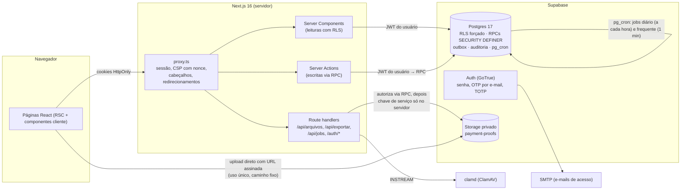

# Arquitetura

## Visão geral

## Camadas e responsabilidades

| Camada | Onde | Papel |
| --- | --- | --- |
| Proxy | `src/proxy.ts` | Renova a sessão (tokens rotacionados) em toda requisição, aplica CSP com nonce e cabeçalhos de segurança, `Cache-Control: private, no-store`, exige login em `/app` e `/professor` e nível `aal2` (TOTP) em `/professor`. |
| Páginas | `src/app/**/page.tsx` | Server Components que leem com o cliente Supabase do **próprio usuário**; o RLS decide o que volta. |
| Ações | `src/app/**/actions.ts`, `src/lib/actions.ts` | Server Actions validam a entrada (Zod), chamam **uma RPC** do banco com o JWT do usuário e convertem erros de negócio (`CS4xx`) em mensagens pt-BR. Proteção de origem das Server Actions do Next.js (CSRF). |
| Banco | `supabase/migrations/*.sql` | Fonte da verdade da autorização e das regras: RLS forçado em todas as tabelas públicas, políticas **apenas de leitura**, escritas só por funções `SECURITY DEFINER` com `search_path` vazio, checagem explícita de papel/vínculo, travas (`pg_advisory_xact_lock`, `FOR UPDATE`), auditoria e outbox na mesma transação. |
| Arquivos | `src/app/app/financeiro/[id]/actions.ts`, `src/app/api/arquivos/[id]/route.ts`, `src/lib/files/*` | Upload direto para bucket privado; o servidor valida assinatura real, decodifica imagens, inspeciona PDFs e envia ao clamd antes de liberar. Download só por URL assinada de 60 s após autorização no banco. |
| Jobs | `supabase/migrations/20260927121000_jobs.sql`, `src/app/api/jobs/[job]/route.ts` | pg_cron: `daily` (a cada hora, idempotente) gera aulas (janela de 90 dias), mensalidades, avisos de vencimento/atraso, aplica mudanças de status agendadas e limpa dados operacionais; `frequent` (1 min) processa a outbox e lembretes de aula. Endpoint `/api/jobs/*` (Bearer `CRON_SECRET`) para redundância e para o job de arquivos (órfãos, infectados, reverificação, retenção). |

Não existe cliente Supabase no navegador: nenhum token fica acessível a JavaScript (sem `localStorage`),
e a chave de serviço só é usada em código marcado `server-only`.

## Autenticação e sessão

- **Sem cadastro público** (`enable_signup = false`). Professor: provisionamento administrativo
  (`scripts/bootstrap-coach.ts`). Alunos e responsáveis: convite.
- **Convite**: token aleatório de 32 bytes no **fragmento** da URL (`/convite#…`, não vai para o servidor nem
  para logs; é removido da barra de endereço). O banco guarda só o SHA-256; validade padrão de 48 h (configurável), uso único, preso ao
  e-mail cadastrado; confirmação por código de 6 dígitos enviado ao e-mail; 5 tentativas erradas bloqueiam;
  aceitação atômica (concorrência gera um único vínculo).
- **Professor**: TOTP obrigatório (`aal2`) para qualquer dado — checado no proxy e, de forma autoritativa, no
  banco (`private.coach_org_ids()` só retorna organizações quando o JWT é `aal2`).
- **Step-up**: alterar Pix, estornar pagamento, exportar e anonimizar dados exigem TOTP verificado há no máximo
  15 minutos (carimbo `amr` do JWT); caso contrário o banco responde `CS428` e a tela pede o código.
- **Cookies**: `HttpOnly`, `SameSite=Lax`, `Secure` sob HTTPS, prefixo de sessão do Supabase. Logout por POST
  revoga a sessão, apaga cookies e envia `Clear-Site-Data: "cache", "storage"`.
- **Senha**: mínimo 10 caracteres com letras e números; recuperação por link de uso único (15 min);
  troca de senha exige login recente e encerra as outras sessões.
- **Limite de tentativas** persistido no banco (funciona com várias instâncias): login por IP e por e-mail,
  recuperação de senha, códigos de convite, verificação de MFA, uploads e criação de convites.

## Autorização (defesa em profundidade)

1. **Proxy**: sem sessão → `/entrar`; `/professor` sem `aal2` → `/mfa`.
2. **Páginas/ações**: `requireCoach()` / `participantContext()` resolvem o contexto no servidor; o aluno
   selecionado (cookie `cs-aluno`) é só uma preferência e é revalidado contra os vínculos a cada requisição.
3. **Banco** (autoritativo): RLS de leitura por organização/vínculo; RPCs validam papel, vínculo, restrições
   financeiras e regras de negócio. IDs vindos do cliente nunca concedem acesso por si só.

A matriz completa está em [MATRIZ_DE_PERMISSOES.md](MATRIZ_DE_PERMISSOES.md).

## Agenda

- **Séries recorrentes versionadas** (`recurring_slots` com `series_root_id`, `valid_from`/`valid_until`):
  editar "a partir de uma data" encerra a versão atual e cria outra, preservando aulas passadas, presenças e
  exceções. Restrições de exclusão impedem sobreposição de versões.
- **Ocorrências** únicas por (`series_root_id`, `original_date`), geradas de forma idempotente para 90 dias.
- **Conflitos** checados no servidor sob trava da agenda da organização: professor, quadra, aluno e tempo de
  deslocamento entre locais — inclusive nas recorrências futuras.
- **Capacidade**: aprovação de pedido e matrícula direta travam a série; duas aprovações concorrentes pela
  última vaga geram uma única matrícula.
- Cancelamento não vira falta e não gera crédito/reposição automática (fora do escopo, por decisão do cliente).

## Financeiro

- Valores em **centavos inteiros**; vencimento em dias 29–31 cai no último dia de meses menores.
- Geração de mensalidades **idempotente** por (aluno, competência), com antecedência configurável, respeitando
  status (ativo/pausado) e o valor vigente (snapshot na cobrança).
- Comprovante **não é pagamento**: o professor confere no banco e aprova; aprovação duplicada não duplica
  receita (índices únicos e chaves de idempotência). Estorno preserva a trilha e reabre a cobrança.
- **Inadimplência** calculada na hora (data local), sem depender de job: `warn_only`, `block_requests` ou
  `restrict_modules`, com carência; liberação/bloqueio manual com motivo, validade e auditoria. Restrições
  nunca impedem ver as mensalidades, o Pix e enviar comprovante (regularização).

## Avisos (notificações)

Cada alteração relevante grava um evento em `private.outbox_events` na **mesma transação** (com chave de
deduplicação). O job `frequent` resolve os destinatários **no momento do envio** (vínculos revogados não
recebem), renderiza o texto e grava em `public.notifications` sem duplicar em retentativas; falhas têm
retentativa limitada e não bloqueiam os demais. A tabela `private.notification_deliveries` (canais
`whatsapp`/`email`) está preparada para um futuro trabalhador de envio; **nenhum provedor está integrado**.

## Fuso horário e localização

Datas "de negócio" (vencimento, dia da aula, atraso) são calculadas no fuso da organização
(`America/Sao_Paulo` por padrão) com `private.local_date_at`/`org_today`; instantes ficam em `timestamptz`.
Interface em pt-BR, valores em BRL (`Intl.NumberFormat`).

## Observabilidade

- `/api/health` para monitor externo (sem dados).
- Tela **Configurações › Sistema** (professor) com `job_health()`: último resultado de cada job, fila de
  avisos pendente/falha, arquivos aguardando verificação e uploads presos.
- Logs do servidor em JSON sem conteúdo sensível (sem tokens, chaves Pix ou conteúdo de arquivos).
- `public.audit_events` é imutável (trigger bloqueia UPDATE/DELETE) e registra quem, o quê e quando.
