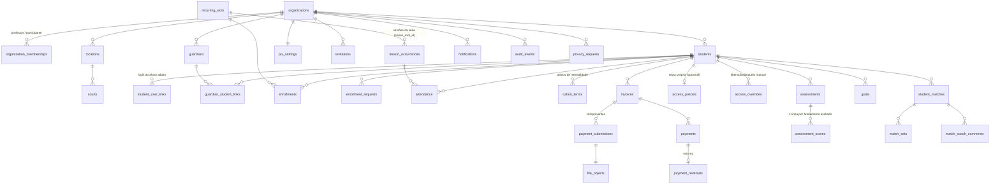

# Modelo de dados

Fonte: `supabase/migrations/` (13 migrations, aplicadas em ordem). Tipos TypeScript gerados em
`src/lib/database.types.ts` (`npm run db:types`).

## Esquemas

| Esquema | Exposto pela API? | Conteúdo |
| --- | --- | --- |
| `public` | Sim (somente leitura com RLS; escrita só por RPC) | Dados de negócio (37 tabelas, todas com RLS **habilitado e forçado**) |
| `private` | **Não** | Hash dos tokens de convite, outbox de eventos, entregas por canal (futuro), limites de tentativas, histórico de jobs, estado de restrição; funções internas |
| `auth` / `storage` | Gerenciados pelo Supabase | Usuários, sessões; metadados dos arquivos |

## Diagrama (principais relações)

## Tabelas por domínio

**Pessoas e acesso** — `organizations` (configurações: fuso, validade do convite, antecedência de cobrança,
deslocamento padrão, lembretes, janela de aulas, retenção de comprovantes, dados do controlador),
`organization_memberships` (`coach` | `participant`), `user_profiles` (nome, tema), `students` (`adult` | `child`,
status com data efetiva, anonimização), `student_status_changes`, `student_private_notes` (só professor),
`guardians`, `guardian_student_links` (revogáveis), `student_user_links` (login do aluno adulto, revogável),
`invitations` (+ `private.invitation_tokens` com o hash).

**Agenda** — `locations`, `courts`, `unavailability_periods`, `recurring_slots` (série versionada),
`lesson_occurrences` (aula concreta, com exceções), `enrollments` (vigência), `enrollment_requests`, `attendance`.

**Financeiro** — `pix_settings`, `tuition_terms`, `invoices`, `payment_submissions`, `file_objects`, `payments`,
`payment_reversals`, `access_policies` (regra da organização ou por aluno), `access_overrides`.

**Evolução e jogos** — `assessments` (rascunho/publicada), `assessment_scores` (fundamentos: forehand, backhand,
saque, devolução, voleio, movimentação, consistência, tomada de decisão; nota 1–5; ausência = "não avaliado"),
`assessment_private_notes`, `goals`, `student_matches` (resultado derivado do placar ou W.O./desistência/incompleto),
`match_sets` (games, tie-break, match tie-break), `match_coach_comments`.

**Avisos, auditoria e privacidade** — `notifications`, `audit_events` (imutável), `privacy_requests`
(acesso, correção, exportação, exclusão).

## Integridade garantida pelo banco

| Regra | Como |
| --- | --- |
| Referências nunca cruzam organizações | Chaves estrangeiras compostas `(organization_id, id)` com índices únicos correspondentes |
| Série sem versões sobrepostas | `EXCLUDE USING gist (series_root_id, daterange(valid_from, valid_until))` |
| Aluno sem matrícula duplicada na mesma série e período | `EXCLUDE` em `enrollments` para matrículas ativas |
| Planos de mensalidade sem sobreposição | `EXCLUDE` em `tuition_terms` |
| Uma aula por série e data original (geração idempotente) | Único `(series_root_id, original_date)` |
| Uma cobrança por aluno e competência (exceto canceladas) | Único parcial `(student_id, competence)` |
| Um pagamento ativo por cobrança; sem receita duplicada | Único parcial `payments(invoice_id) where reversed_at is null`, únicos em `submission_id` e `idempotency_key` |
| Um estorno por pagamento | Único `payment_reversals(payment_id)` |
| Um pedido pendente por aluno e série | Único parcial em `enrollment_requests` |
| Um convite pendente por aluno/responsável | Únicos parciais em `invitations` |
| Uma presença por aluno e aula | Único `(occurrence_id, student_id)` |
| Aviso não duplica por evento e destinatário | Único `(event_id, recipient_user_id)` |
| Valores e formatos | `CHECK` em centavos (> 0), notas 1–5, placares, dia de vencimento 1–31, tamanho ≤ 10 MB, tipos de arquivo, fuso válido, e-mail, chaves Pix (CPF/CNPJ com dígito verificador) |
| Auditoria imutável | Trigger impede `UPDATE`/`DELETE` em `audit_events` |

## Dados derivados (não armazenados)

- **Atraso** de cobrança: `status in (open, under_review) and due_date < hoje local`.
- **Nível de restrição** do aluno: calculado na hora por `private.compute_restriction` (regra + carência +
  liberações vigentes). `private.restriction_states` guarda só o último nível para emitir aviso de mudança.
- **Frequência**: presentes ÷ marcações em aulas concluídas; "não informado" e aulas canceladas ficam à parte.
- **Estatísticas de jogos**: percentual só com partidas concluídas; W.O., desistência e incompleto à parte.

## Seed

`scripts/seed-demo.ts` cria somente dados fictícios (domínio `demo.cstennis.test`, chave Pix aleatória de
exemplo, comprovante gerado por código). Recusa rodar fora do Supabase local, exceto em homologação com
`--allow-staging` e `APP_ENV=staging`.
